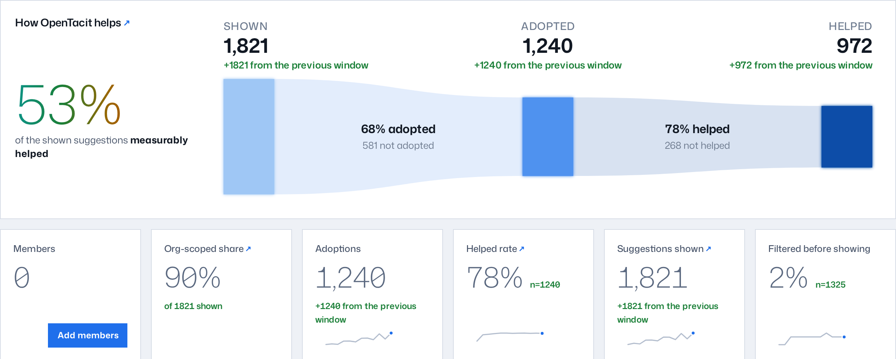

# OpenTacit at a glance

Your colleagues know useful ways to work with AI. OpenTacit records those methods
and offers them during relevant work, along with measured results.

AI models get more capable every day. But people do not use a new ability when
they do not know that it exists. This gap between what a model can do and what
its users try has a name: the "technique overhang".

Models do not know all of your organization's data, systems, or conventions.
OpenTacit lets experienced AI users share what they have learned without taking
time from each person who needs it.

## The loop

You work as usual in your AI coding tool: Claude Code, Codex, Gemini CLI,
GitHub Copilot CLI, Cursor, Amp, pi, omp, or opencode. OpenTacit calls this tool
your *harness*. While you work:

1. A small local agent examines each completed turn. It identifies the type
   of task you do.
2. It asks your organization's shared *registry* if a validated technique
   from your organization's playbook matches your task.
3. If a technique matches, OpenTacit offers it in your session, below the answer
   you read. OpenTacit includes the measured evidence, for example
   "helped 94% · n=120."
4. Feedback goes back to the registry: if you adopted the suggestion, and if
   it helped. OpenTacit uses this evidence to rank later suggestions.

This loop does not need you to change how you work. OpenTacit observes, offers,
and measures. You keep control.

## Techniques and the playbook

The unit of knowledge is a *technique*: one validated move, with a written
description that lets another person use it. Together, your organization's
techniques form its *playbook*: the measured memory of what works with AI. A
technique contains:

- **Name and description** — what the move is
- **Recipe** — the concrete steps to apply it
- **Applies when / not when** — the situations that it fits, and the
  situations that it does not fit
- **Tags and task types** — how OpenTacit categorizes and matches it
- **Outcomes** — the measured evidence: how many times members saw it,
  adopted it, and got help from it

OpenTacit always shows a technique's evidence as measured, for example "measured
by colleagues: helped 94% · n=120". If nobody has tried the technique, OpenTacit
shows "awaiting measured outcomes". OpenTacit never invents evidence.

## The life of a technique

Techniques enter the registry as *drafts*. A draft has one of four sources: a
member contribution, a proposed revision, a research pass, or an import from
another organization. Retrieval does not serve a draft to anyone until a
reviewer *promotes* it on the [Review page](../30-dashboard/11-review-drafts.md).
After promotion, OpenTacit can suggest the technique and collect evidence about
its results. If a technique's recent results fall below its own baseline,
OpenTacit flags it as *decaying* and puts it in the queue for revalidation. You
can *retire* a technique that no longer gets good results. You can restore a
retired technique later if it is necessary again.

## Scope

Every technique is **general** (good practice in all places) or **org-scoped**
(specific to how your organization works). Org-scoped techniques show an `org`
badge in all parts of the dashboard.

## Evidence

OpenTacit uses feedback to record four stages:

| Stage | Meaning |
|---|---|
| Shown | A member saw the technique: a push suggestion, or the one technique that an `@tacit` answer cites. A search of the playbook does not count |
| Adopted | The member acted on it, and there is proof |
| Helped | It improved the outcome, and OpenTacit measured this |
| Dismissed | The member declined it, with a reason |

OpenTacit captures most feedback automatically from what you do and say. You
rarely need to record it yourself. See
[Give feedback](../20-sessions/07-give-feedback.md).

## Cohorts, never identities

The registry stores outcomes by *cohort*: aggregate dimensions such as team,
role, and harness. The registry never stores who did what. This is
intentional. Your personal record of the suggestions that you adopted or
dismissed stays in a file on your own machine. The file stays on your machine
only. Each report about "who" is about cohorts, never about individual
people. Reports show which cohorts use each technique and do not rank people.
See the privacy notes in
[Join your organization's registry](03-join-your-organization.md) and
[Give feedback](../20-sessions/07-give-feedback.md).

## The three surfaces

- **Your session** — suggestions arrive during your work; slash commands
  such as `/tacit:search` and `/tacit:contribute` operate on demand.
- **The dashboard** — the registry's web app: Outcomes, Playbook, and
  Review, plus administration.
- **The command line** — the single `tacit` binary sets up, connects,
  diagnoses, and serves everything.

The next two chapters make OpenTacit operational for you.
[Set up a registry](02-set-up-a-registry.md) if your organization does not
have one. Or [join the registry it has](03-join-your-organization.md).
