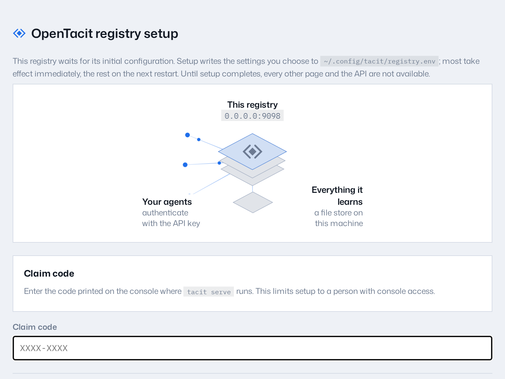

# Set up a registry

The registry is the shared service that holds your organization's playbook.
It is one Go binary. The binary stores the techniques, measures the outcomes,
serves the dashboard, and answers your colleagues' harnesses. This chapter is
for the person who sets up the registry. If you only want to connect to a
registry that exists, go to
[Join your organization's registry](03-join-your-organization.md).

## Install OpenTacit

Download the latest release. The installer checks the checksums before it
changes anything:

```bash
curl -fsSL https://opentacit.com/install.sh | sh
```

## Bootstrap the registry

Run:

```bash
tacit init
```

`tacit init` is idempotent: it adds only what is absent, and it explains each
item that it sets up. In one pass it:

- Writes the registry configuration to `~/.config/tacit/registry.env` and
  creates an API key. The key stays in that file; `tacit init` names the file
  rather than printing the secret
- Creates the data directory and adds a starter set of techniques
- Downloads the semantic retrieval model (about 90 MB). The model matches
  techniques by meaning, not by keyword overlap
- Signs this machine's operator in as the registry's owner, and prints a
  sign-in link for the dashboard. A registry that already uses an identity
  provider keeps it; nothing is added
- **Gives the registry an address on the internet**, through the shared OpenTacit
  proxy, so you can open the dashboard from a laptop or a phone rather than
  only from the machine it runs on. Your techniques stay put: contributing them
  to the public pool is a separate yes, in Settings, asked for when a technique
  is actually eligible. See [The address](#the-address)
- **Reads this repository's written conventions into the review queue.** If you
  run the command inside a checkout, OpenTacit reads `CLAUDE.md`, `AGENTS.md`,
  `.cursorrules`, the copilot instructions, and the skills, commands and
  prompts under `.claude/` — and files each rule as a draft technique. OpenTacit
  does not suggest a draft until you promote it. See
  [Where your first techniques come from](#where-your-first-techniques-come-from)
- Prints a short summary: the dashboard address, where the settings live, how
  many drafts are waiting, and whether a model key is configured. Add
  `--verbose` for the step-by-step, which names every file it wrote and every
  setting it chose

Then, if you are at a terminal, it serves the registry: it stays in the
foreground, prints the sign-in link once the registry answers, and stops with
Ctrl-C. Run the command again to serve the same registry at the same address.
In a script it configures and returns, and tells you how to start it.

**It installs no service.** For a personal registry, start it when you need it.
If other people need regular access, install a service that starts after a
reboot. [Turning on sign-in](#turn-on-sign-in) installs it for you. If you are
setting up a shared server from the start, run:
`tacit init --service auto`.

The owner signs in from this machine and needs no identity provider. When you
are ready for one, [turn on sign-in](#turn-on-sign-in) — the registry keeps
its address, its data, and its members.

You can control each step with flags:

| Flag | Values | What it controls |
|---|---|---|
| `--embeddings` | `on`, `off`, `auto` | Controls the download of the semantic retrieval model. With `auto` (the default), OpenTacit downloads it on platforms that support it. On other platforms, OpenTacit uses the built-in lexical matcher. |
| `--service` | `systemd`, `launchd`, `none`, `auto` | How the registry stays in operation. With `none`, run it in the foreground yourself with `tacit serve`. |
| `--port` | a port number | The port to serve on. The default is 8080. |
| `--from-repo` | `auto`, `off`, a path | Which repository's conventions to read into the review queue. With `auto` (the default), the working directory when it is a checkout, and nothing otherwise. |
| `--global-access` | `on`, `off`, `auto` | Whether to give the registry an address on the internet through the shared proxy. With `auto` (the default), on for a registry that has a sign-in, has no address of its own, and can reach the proxy. |

**Note:** On Linux, run `loginctl enable-linger $USER` so that the user
service continues after you sign out.

## Or run it in a container

The official image contains the same registry on a minimal (distroless) base.
The image includes semantic retrieval, so there is no download at first boot:

```bash
docker run -d --name tacit -p 8080:8080 -v tacit-data:/data ghcr.io/opentacit/tacit:latest
docker logs tacit    # the first-run claim code appears here
```

Then claim it in the browser with the steps below. The registry writes all
its data to the `/data` volume: settings, techniques, and the SQLite store
(`tacit.db`, the default backend of the image). A backup of the volume is a
backup of the registry. If you recreate the container, you lose nothing. An
older image stored JSON files instead. If a volume comes from an older image,
the registry imports the files into SQLite automatically at first boot. The
registry keeps the old files in place. To upgrade, pull a newer tag and
recreate the container (`tacit upgrade` in a container refuses and says so).
A reference
[docker-compose.yml](https://github.com/opentacit/tacit/blob/main/deploy/docker-compose.yml)
is in `deploy/`. It contains the reverse-proxy settings:
`TACIT_EXTERNAL_URL`, and `TACIT_BASE_PATH` for a
[sub-path](../40-administration/14-configure-the-registry.md#serve-under-a-sub-path).

## Claim the registry

If you start the registry without configuration (for example, `tacit serve`
on a new machine), it enters first-run setup and does not serve. The console
prints a claim code. Every page redirects to a setup form.



1. Open `http://localhost:8080/setup` in your browser.
2. Enter the claim code from the console.
3. Click **Configure registry**.

The other settings have defaults. To change them now, open **Advanced
settings** below the claim code. It contains the API key and external URL, the
address to serve on, storage, sign-in, administrator emails, federation
identity, and the embedder and model API key. You can also change them later in
Settings.

OpenTacit validates what you gave it, writes it to `registry.env`, applies what it
can immediately, and tells you if a setting needs a restart.

The confirmation page shows the generated API key one time. If you did not
configure an identity provider, the claim also makes you the registry's owner —
the same gate `tacit init` sets up — so run `tacit dashboard` on the console for
a sign-in link.

## Turn on sign-in

A new registry signs one person in: you, its owner, proved by access to the
machine it runs on. That is right for a pilot and for a registry only you use.
When colleagues need to sign in with their own accounts, configure OIDC with
your identity provider (Google, Okta, and similar providers).

If the registry is yours alone and you are signed in with the owner link, do
it from the dashboard: **Settings → Access and sign-in**, and move the Sign-in
switch from **Personal** to **Shared**. The page tells you the callback URL to
register with your provider, takes the client that you make there, and — on
**Save changes** — restarts the registry so the settings take effect.

The console does the same thing, and is the only way when the dashboard has no
administrator or its sign-in is already wrong. Run `tacit secure` on the
registry machine. The command tells you the callback URL to register with your
provider, takes the client that you make there, and starts the registry as a
service (systemd on Linux, launchd on macOS) so that it is up when your
colleagues sign in. If a service already runs the registry, the command restarts
it. If you started the registry in a terminal, stop it yourself; the command
will not stop a process that it did not start. After that, every dashboard page asks
visitors to sign in with their organization account. Use `--admins` (or
`TACIT_ADMIN_EMAILS`) to limit administrative actions to specific people, and
`tacit secure --off` if you must open the dashboard again. The steps, and the
`registry.env` settings behind them, are in
[Turn on sign-in](../40-administration/14-configure-the-registry.md#turn-on-sign-in).

## The address

`tacit init` gives a new registry an address on the internet by default through
a proxy OpenTacit runs. Without this address, the sign-in link uses the machine's
loopback address. For a registry set up on a server over SSH, somebody must then
forward a port to open the dashboard.

The proxy has these constraints.

**The proxy terminates TLS.** It can read what passes through it. If that is not
acceptable for your organization, use your own address instead — set
`TACIT_EXTERNAL_URL` — or run `tacit init --global-access off` and reach the
registry over your own network.

**Your techniques remain in the registry.** A separate setting can send this
registry's strongest general techniques to a public pool shared with other
organizations. `tacit init` cannot turn that setting on. A person must select
the box in **Settings → Access and sign-in**. A new registry has
nothing eligible for it in any case, because a technique reaches the pool only
after your colleagues' outcomes clear its evidence floor. OpenTacit asks when the
first one does, and shows you exactly which techniques it covers.

**It needs a sign-in.** OpenTacit will not put a public address in front of a
dashboard anybody can read. `tacit init` sets up owner sign-in, so this is
already true; a registry with neither owner sign-in nor an identity provider
keeps a local address until it has one.

If `tacit init` cannot reach the proxy, it keeps the local address and does not
keep retrying. You can turn on the proxy later in Settings.

## Make it reachable another way

A registry on a laptop or an internal network is available to the people who
can reach that machine. If you turned the shared proxy off, there are two other
ways to open it more widely.

**Use the proxy that your organization already has** — a reverse proxy or a
tunnel. Set `TACIT_EXTERNAL_URL` to the address that members will use. Then
invites, links, and sign-in redirects carry that address. The registry can
have its own hostname, or it can share one under a sub-path
(`https://demo.example.com/apps/tacit`). A sub-path also needs
`TACIT_BASE_PATH`. See
[Serve under a sub-path](../40-administration/14-configure-the-registry.md#serve-under-a-sub-path).

**Or turn the shared proxy back on.** One switch in **Settings → Access and
sign-in**, or one line:

```bash
TACIT_GLOBAL_ACCESS=1
```

See [The address](#the-address) above for what the proxy can see and what stays
here, and [Publish through the OpenTacit
proxy](../40-administration/14-configure-the-registry.md#publish-through-the-opentacit-proxy)
for the effects on you and on your members.

## Check the health

```bash
tacit doctor
```

`tacit doctor` checks the service, the permissions of the configuration file,
the API key, and the embedder. It reports each check as `ok`, a warning, or a
failure with the fix. See
[Troubleshooting](../50-reference/15-troubleshooting.md).

## Where your first techniques come from

Without any techniques, the registry cannot make suggestions. OpenTacit can import
rules that your organization has already written down.

Run `tacit init` inside a repository and it reads the files where your teams
record how to work with agents:

| File | What OpenTacit takes from it |
|---|---|
| `CLAUDE.md`, `AGENTS.md`, `GEMINI.md`, `CONVENTIONS.md` | one draft per section, or per rule when the file is a list |
| `.cursorrules`, `.github/copilot-instructions.md` | the same |
| `.claude/skills/*/SKILL.md`, `.claude/commands/*.md` | one draft each — a skill is one move |
| `.cursor/rules/*`, `prompts/*.md` | one draft each |

Each draft lists its source file and section. OpenTacit marks imported conventions
as **org-scoped** because they describe your organization's own work. They are
also **drafts**: retrieval excludes them until you promote them on the
[Review page](../30-dashboard/11-review-drafts.md).

A pass files at most 25 drafts. Re-running `tacit init` in the same checkout
does not file the same rule twice. To skip the step, run `tacit init --from-repo
off`; to point it at a different checkout, give it a path.

This import does not use a model. OpenTacit quotes your own words, and you decide
what counts as a technique. You can edit each draft on the Review page. The
[research pass](../30-dashboard/11-review-drafts.md) can use a model later.

## Try it with demonstration data

You can see the dashboard in operation before real usage arrives. Load one
month of simulated organization activity into a scratch registry:

```bash
tacit demo load
```

If a registry already holds real content, the demo driver refuses to load
into it, unless you pass `--force`. Run `tacit demo scenarios` to list the
available scenarios.

## Invite your first members

Create a join link and send it to a colleague:

```bash
tacit invite
```

The link installs OpenTacit, joins the registry, and wires their harnesses in one
step. Links expire after 24 hours by default. Each person who has the link
can join. Thus give the link the same protection as a password-reset link.
You can also add `--repo` to commit a small marker file to a repository.
Colleagues who open that repository then get an automatic invitation to join.
The dashboard's [Members page](../40-administration/12-manage-members.md)
gives the same tools in the browser.

## File locations

| Path | What it is |
|---|---|
| `~/.config/tacit/registry.env` | Registry configuration (`KEY=VALUE`; environment variables override it) |
| `~/.local/share/tacit/data/` | The embedded file store: techniques, events, rollups |
| `~/.local/share/tacit/techniques/` | The curated technique directory |
| `~/.local/share/tacit/models/` | The semantic retrieval model |

The embedded file store needs no external services. Larger deployments can
move to Postgres with `tacit migrate-store`. See
[Configure the registry](../40-administration/14-configure-the-registry.md).
