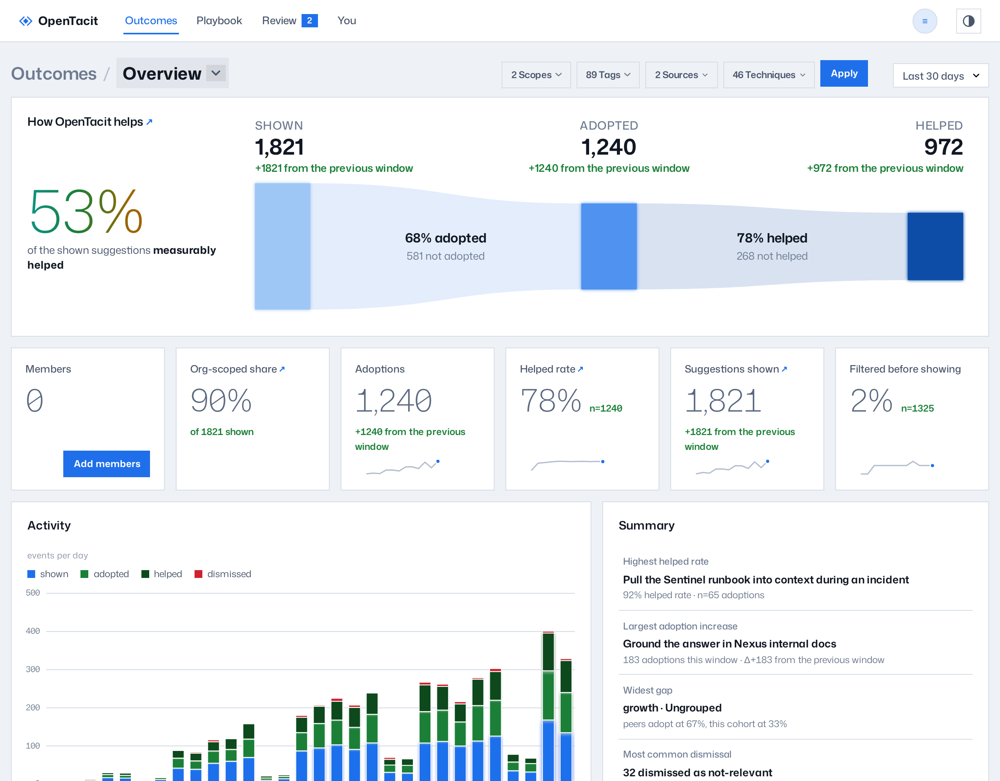
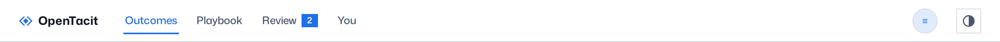

# Get to know the dashboard

The dashboard is the web app of the registry. In the dashboard, you read
outcomes, browse the playbook, and make review decisions. Open the address
of your registry in a browser. The dashboard and the service use the same
address.

## Sign in

If your organization configured sign-in, each page asks you to sign in with
your organization account. Click Sign in. Then follow the steps from your
identity provider. If the dashboard opens without a sign-in request, sign-in
is not configured. See
[Configure the registry](../40-administration/14-configure-the-registry.md).

## Find your way around

The top bar has four destinations, from left to right:

- **Outcomes** — the landing page. It shows the playbook's results through
  the funnel, trends, and other key measures. See
  [Explore outcomes](09-explore-outcomes.md).
- **Playbook** — the library of your organization's techniques. It opens on
  the playbook map. See [Browse the playbook](10-browse-the-playbook.md).
- **Review** — the queue of decisions. A badge on Review counts the drafts
  that wait. A warning badge counts the techniques that decay. See
  [Review drafts and flagged techniques](11-review-drafts.md).
- **You** — your own numbers, read from your own machines. The registry cannot
  collect this view. It opens on Now: what is left of your
  allowance, what is running, and what the period came to. See
  [Read your own usage](12-your-usage.md).

The account button is at the right end of the bar. It opens a menu with
these items:

- **Settings** — the operator's section. It opens on General, and the
  breadcrumb switcher reaches Members, Federation, and Learning readiness.
- **Documentation** — this guide
- Sign out

Breadcrumbs below the bar show your position. On Outcomes and Playbook
pages, the last breadcrumb is a menu. This menu changes between the views
of that section.

## Work the pages

Some controls operate the same on all pages:

- **Find** — type in the Find field in the top bar. The rows on the
  screen decrease immediately to the rows that match. Find hides rows that
  are already on screen; the filters below scope the data itself. The
  dashboard hides the field on pages that have no rows to find.
- **Sortable tables** — click a column heading to sort the table. Click the
  heading again to reverse the order. Click a third time to go back to the
  initial order.
- **Rows are links** — click a table row to open the detail page of that
  row.
- **Time window** — pages that show measurements have the same period
  selector: Last 7 days, Last 30 days, Last 90 days, or All time. Your
  selection stays when you move to a different page.
- **Filters with chips** — list pages have filter menus for scope, tags,
  and source. Each filter that you apply becomes a chip. To remove one
  filter, click its chip. To remove all filters, click the Clear link.
- **Theme** — the toggle in the top bar changes between the system, light,
  and dark themes.

## Read the documentation in place

Click the account button. Then select Documentation. The registry serves
its own documentation, and this guide is part of it. The documentation has
the same search filter and navigation as the other dashboard pages.

## Add it to your home screen

You can install the dashboard as an app. Use the install action or the
add-to-home-screen action of your browser. The dashboard then opens in its
own window with the ◆ mark of the registry.
