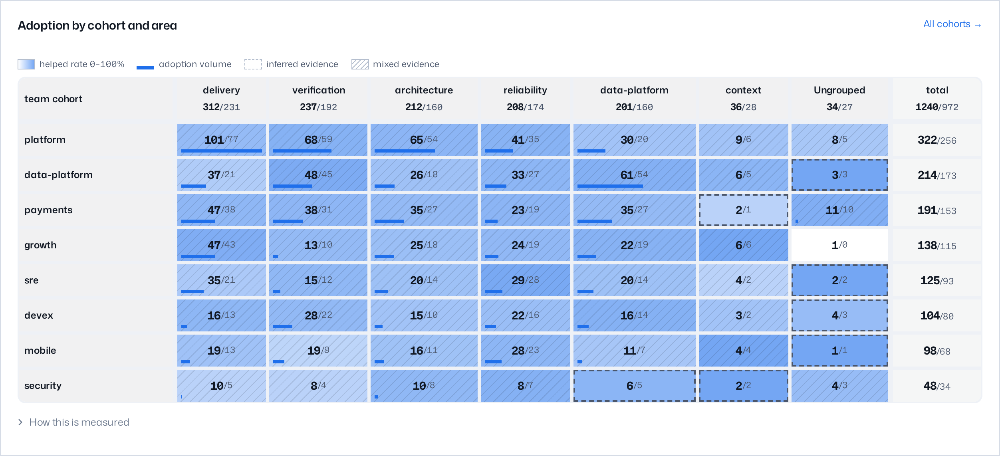

# Explore outcomes

Outcomes is the landing page of the dashboard. It shows whether the
system helps.

First, select a time window: Last 7, 30, or 90 days, or All time. Then use
the filter bar to limit the page to specified scopes, tags, sources, or
techniques. The window and filters apply to all panels on the page.

## The funnel

The main number shows the percentage of shown suggestions that gave
measured help. The panel draws this as the shown → adopted → helped flow.
It also shows the change from the previous window. Five pulse tiles below
the number show these values:

- Org-scoped share
- Adoptions
- Helped rate
- Suggestions shown
- Filtered before showing — the share of retrieved candidates that failed
  the fit check. These candidates got to no member. A lower value is
  better.

Click the panel to open [the activity feed](#the-activity-feed). The feed
shows the events that are the source of the same numbers. "Shown" counts
the techniques that a member saw. A playbook search with `/tacit:search`
does not increase the count.

## Summary

Adjacent to the activity chart, OpenTacit shows the most important items. Each
item links to its evidence:

- **Highest helped rate** — the technique with the strongest helped evidence
- **Largest adoption increase** — the technique with the fastest increase in
  adoptions
- **Widest gap** — a cohort that is behind its peers on a technique that
  helps those peers
- **Needs review** — how many techniques have evidence in decay. Where none
  do, **Most common dismissal** takes the slot and names the reason members
  give most often.

## Leaderboards

The leaderboards show these lists:

- Most adoptions
- Highest helped rate — the list marks the organization average. Techniques
  with fewer than three adoptions get no rank.
- New activity

Click a technique to open its details.

## Cohorts

The adoption heatmap is a matrix of cohorts and areas of practice. The
columns are the groups from the Playbook map. Thus the matrix and the map
use the same names for the areas of the organization. Each cell shows the
adopted count and the helped count. The color of a cell shows the helped
rate. The Group by control changes the dimension: team, role, harness, or a
different dimension that your organization reports. Click "All cohorts" to
open the full cohort table. Click a cohort to open the funnel and activity
detail of that cohort.

## Knowledge mix and health

The last panels give data about the playbook itself. They show:

- The share of the playbook that is org-specific
- The sources of the techniques
- The distribution of dismissals across the reasons
- The calibration of inferred signals against explicit signals (signal
  trust)
- The health of the registry

## The activity feed

The funnel shows the totals. The **Events** view shows the detail. It is a
feed of OpenTacit activity, with the newest events first. To open the feed, use
the view-switcher in the breadcrumb (Overview · Cohorts · Helped rate ·
Signal trust · Events), or click the funnel panel. The feed contains two
types of events:

- **Delivery** — a technique event from one real interaction: shown,
  adopted, helped, or dismissed. Deliveries include the techniques that an
  agent applied automatically.
- **Curation** — an automated change to the playbook. Examples: OpenTacit
  found a technique in usage data, promoted a technique based on its evidence,
  retired a technique, or flagged a technique for decay. Each event
  includes the reason.

A "By technique" table is at the top of the feed. It shows the funnel of
each technique for the window. A cohort filter limits the feed to one
cohort. The feed opens with a short list. The buttons under it show more
events, each naming how many. The feed shows only cohort-level data, the same
as all OpenTacit views. It contains no member identity and no session identity.
The feed does not show evaluation telemetry by default. This telemetry
includes the candidates that OpenTacit removed before a member saw them, and
the shadow evaluations. Click **Show evaluation telemetry** to see it.

## Drill-downs

The view-switcher in the breadcrumb moves between the views of the section:
Overview, Cohorts, Helped rate, Signal trust, and Events. Each number on
the page is also a link. The most useful destinations are:

| Page | What it shows |
|---|---|
| A technique's outcomes | All measurements for the technique: funnel tiles with sparklines, cumulative adoption, cohort spread, dismissal reasons, and the technique itself |
| Cohorts | The funnel of each cohort, compared with the organization baseline |
| Helped rate | The distribution of helped rates, and each measured technique in a list with the lowest rate first |
| Signal trust | Explicit feedback compared with inferred feedback, and the calibration gap for each technique |
| Events | The activity feed with the deliveries and the curation events of the playbook |
| Dismissals by reason | The techniques that members dismiss, and the importance of each reason |
| A tag, task type, or source | The combined funnel for that part of the playbook |

## Read the numbers responsibly

Two rules keep the evidence correct:

- Be careful with small samples. A 100% helped rate from two adoptions has
  only two events as proof. For this reason, the leaderboards give no rank
  to techniques with few adoptions.
- Read the cohort views as locations where a proven technique can spread.
  Example: one team has a technique that a different team can use. Do not
  read the cohort views as ranks of persons. The registry does not know who
  did what. This is intentional.
