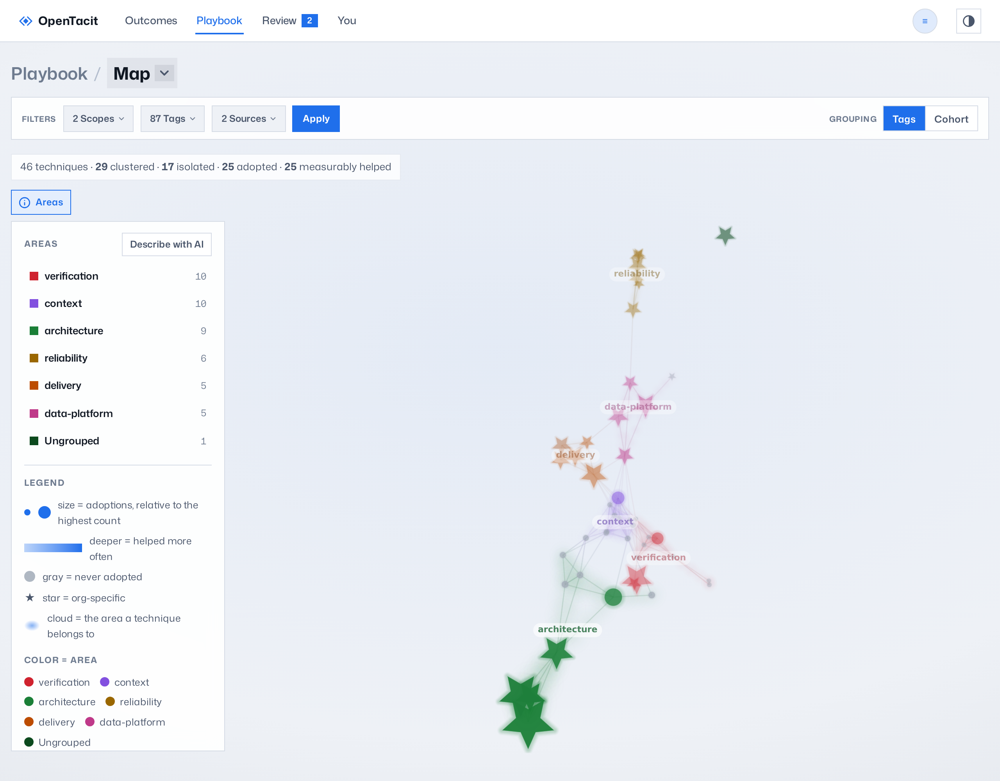
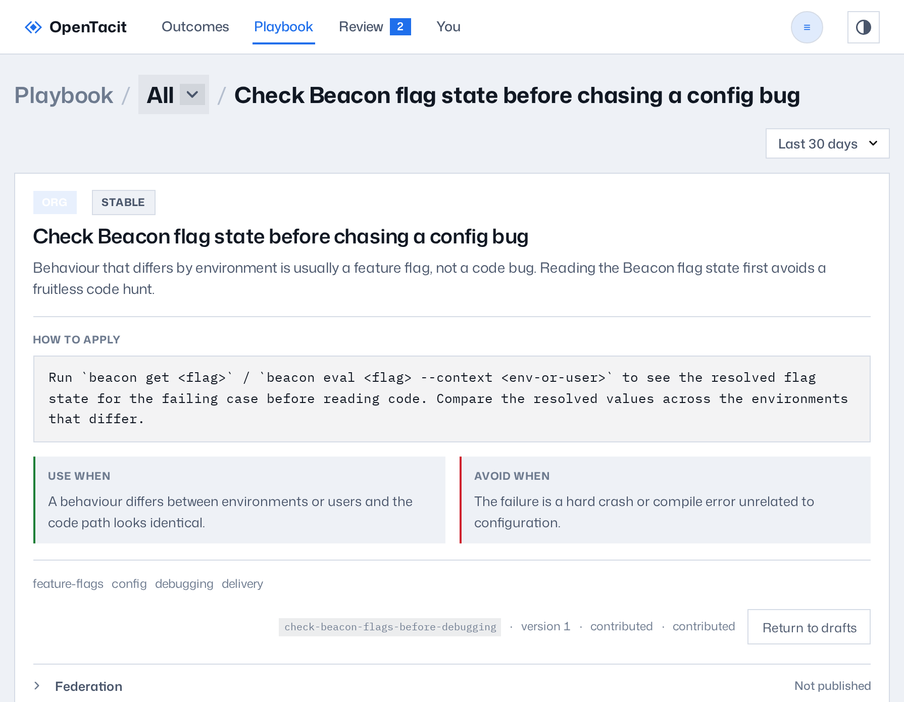

# Browse the playbook

The Playbook section is the library. It shows all validated techniques of
your organization in four views. Click Playbook in the top bar to open the
map. The map is the default view. Use the menu in the breadcrumb to change
between the views: Map, All, Retired, and Tags.

## The map

The map draws the full live playbook as a network. Each technique is a
node. A node is near the techniques that have the same tags. The nodes make
clusters, and each cluster is an area of practice.

- **Size** shows the adoptions.
- **Color depth** shows the helped rate.
- **Gray** shows a technique with no adoptions.
- **★** identifies org-specific techniques. A star, not a circle, stays
  clear at the smallest node sizes.
- Click a node to see its details in place. Drag to turn the field. Scroll
  to zoom.
- The **Grouping** control changes the arrangement between Tags and Cohort.
  Your selection stays.
- The **Areas** button opens an overlay. The overlay lists the clusters
  that the map found. It also explains how to read the field.
  Administrators can click **Describe with AI** to have the model give each
  area a name and description when the current labels are not clear enough.

## The list

The All view shows the same library as a table with the name, source, and
tags. The table has the same areas of practice as groups, and you can
collapse each group. Each group header shows the totals of the group:
technique count, adoptions, and helped rate. Org-specific rows have an
`org` badge.

- Filter by scope, tags, or source.
- Click a tag to see its performance.
- Click a row to open the technique.

## A technique's page

The page of a technique shows all its contents: the description, the
recipe, when the technique applies, when it does not apply, the tags, the
provenance, and the version. The page also shows the measured outcomes,
with a link to the full outcomes record. If the technique has earlier
versions, its history page shows each version, with the newest first.

Administrators can do these actions from this page:

- **Return to drafts** removes a live technique from service and puts it
  back in the review queue. Use this action when a technique needs rework.
- **The federation panel** publishes the technique to one or more named
  channels. The panel can also unpublish the technique. See
  [Share techniques between organizations](../40-administration/13-federate.md).

## Retire and restore

Retrieval does not send retired techniques to members. The registry keeps
them in the Retired view. Each row has a
Restore action. This action puts the technique back in service.

## Keep the tag vocabulary healthy

Tags control the map's clusters, the filters, and part of retrieval.
Inconsistent terms ("db", "database", "postgres") split related
techniques. Use the Tags view for maintenance:

1. Examine the table. It shows each tag, the number of techniques that
   have the tag, and a flag on the tags that only one technique uses.
2. To merge a tag or to rename it, type the target name in its row. The
   field completes the name from the live vocabulary. Then click Apply.
3. To remove a tag from all techniques, click Delete. Then confirm.
4. To get help, click **Suggest merges**. The model reads the full
   vocabulary and proposes merges. You apply or discard each proposal, one
   at a time. The system never applies a proposal automatically.
