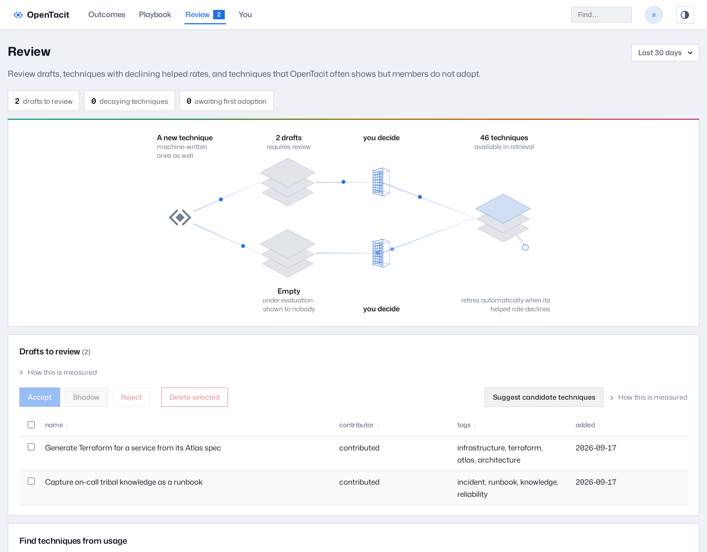

# Review drafts and flagged techniques

Use the Review page to make these decisions:

- Drafts to promote or reject
- Techniques under evaluation in the shadow lane
- Techniques with evidence that decays
- Techniques that members see but do not adopt

The badge on Review in the top bar counts the pending items. When the page
shows no items, the queue is empty.

**Tip:** Draft decisions do not need the dashboard. The command
`/tacit:drafts` in a session runs the same queue. The queue shows as an
interactive panel, a native form, or a conversation. The type depends on
your client. See
[Search and review on demand](../20-sessions/05-search-and-review.md).

Each section below has a count in the queue line at the top of the page.
Click a count to go to its section.

## Decide on drafts

Each draft waits here, with the newest first. Drafts come from these
sources:

- A member contributed it.
- A person proposed it as a revision.
- A research pass filed it.
- An import from a different organization added it.

Each row shows the contributor, the tags, and the date of addition. Sort
by a column, or use the filter box to decrease the list.

To review one draft:

1. Click the row of the draft.
2. Read the technique. For a revision, the page also shows the technique
   that it replaces, the note of the proposer, and a field-by-field diff
   against the current technique.
3. If the draft needs work, edit it in place. You can edit the name,
   description, recipe, applies when, not when, and tags. Then click Save
   edits.
4. Click **Accept** to put the draft in service, or **Reject** to refuse
   it. **Shadow** sends it to the evaluation lane below instead, where it is
   checked for relevance without being shown to anybody.

A promoted technique goes into service immediately and starts to collect
evidence. The registry keeps a rejected draft. It does not erase it.

To decide on several drafts at once, select their checkboxes in the list.
The buttons above the table apply one decision to everything you select.
**Accept**, **Shadow** and **Reject** do what the same buttons do on a
single draft. **Delete selected** removes the drafts fully, for example
spam or the results of a bad research pass. You must confirm the deletion.
Deletion applies only to drafts. You cannot undo a deletion.

## Techniques under evaluation

The **shadow** lane is between draft and live. In this lane, the fit-check
scores a technique's relevance against real work, but the system never
shows the technique to a member. The section under the drafts lists the
techniques in this lane.

This lane is different from the drafts above it. A draft is inert: the
system does not retrieve it, does not fit-check it, and gathers no
evidence about it. A draft moves only when a person moves it. A technique
under evaluation is measured while it waits.

The section shows which of the two it is:

- **Under automatic evaluation.** Auto-promote is on. The section reports
  how far each technique is from the bar, for example
  `62% · 8 of 12 judged`. You do not need to act. The system starts serving
  a technique when it clears the bar and retires it when it rarely fits.
  To decide one now instead of waiting, click the row to open
  the technique and use **Accept** or **Reject** there.
- **Under evaluation: review required.** Auto-promote is off, so nothing
  moves until you decide. Each row carries **Accept** and **Reject**.

See [Configure the registry](../40-administration/14-configure-the-registry.md).

**Find techniques from usage** — this panel is at the bottom of the page.
Its button groups the successful member actions that have no technique into
new candidate techniques. The system files these techniques as
`observed` and evaluates them in the shadow lane above. The process runs
automatically when auto-discovery is on. The button runs the process
immediately.

## Ask for new drafts

Click **Suggest candidate techniques** to run a research pass. OpenTacit
examines the usage profile of your organization. It finds practices that
match the profile. It files a maximum of ten new drafts in this queue. The
run takes one minute or more. A progress bar monitors the run. The page
loads again with the new drafts when the run completes. The command
`/tacit:suggest` runs the same pass in a session.

Researched candidates are **general**, not org-scoped. They count toward
the general share of your playbook until members adopt them and the
outcomes show help. The share that only your organization knows grows from
what your colleagues use, not from the drafts that this button files. See
[Knowledge mix and health](09-explore-outcomes.md#knowledge-mix-and-health).

Two details of the run:

- A pass files fewer than ten drafts when it finds fewer usable ones. A
  safety screen refuses unsafe proposals, and OpenTacit discards a candidate
  that duplicates a technique that you have.
- One pass runs at a time. A second click joins the pass that runs, and
  does not start another. Nothing failed. Its drafts appear here when it
  completes. The pass continues on the server, so you can reload the page
  or leave it. The page shows the run again when you return.

## Revalidate decaying techniques

This section flags a technique when its recent helped rate decreases below
its own baseline, so it gets a review rather than staying in service based
on old evidence. The table shows the baseline rate, the recent
rate, and the time of the last check for each flagged technique. Click a
row to see the decay curve and the full record. Your options are the
curation actions from the [technique's page](10-browse-the-playbook.md):

- Revise the technique.
- Return it to drafts.
- Retire it.

## Fix what's shown but never adopted

The last section, **Awaiting first adoption**, is the retrieval worklist.
It lists techniques that members see many times but do not adopt. The cause is a retrieval problem
(incorrect technique, or incorrect moment) or a quality problem in the
technique. In each case, a person must decide:

- **Shown, never adopted** — members saw the technique in this window,
  but no member adopted it. Make the "applies when" of the technique more
  exact, adjust its tags, or retire it.
- **Adopted, but shown far more often** — the technique helps, but the
  system offers it too frequently. Usually the limits of the technique
  must become more narrow.
