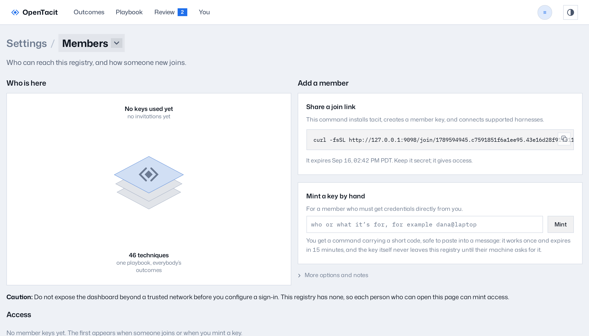

# Manage members

The Members page controls access. It shows the machines that can connect
to the registry. Open Settings from the account menu, then Members. The page is for
access control, not for analytics. The registry never connects member keys
to feedback events. Thus no data on this page shows what a person did.

## Invite a colleague

The page gives two methods to add a member:

- **Share a join link.** Copy the one-line command and send it. The
  command installs OpenTacit, joins the registry, and connects the AI tools of
  your colleague in one step. Links expire. Each person that has a link
  can join. Give a join link the same protection as a password-reset
  email.
- **Mint a key manually.** Enter a label (a name or a machine) and click
  Mint. The page shows the exact `tacit connect` command to send, carrying a
  short code rather than the key itself. The code works once and expires in 15
  minutes, so it is safe to paste into a message; the key it stands for never
  leaves the registry until the member's own machine asks for it. If the code
  lapses before they run it, mint another.

The "More options and notes" section describes the equivalent commands
(`tacit invite`, `tacit join`, and manual installation) and the repository
marker. The command `tacit invite --repo` commits a small file to a
repository. Colleagues who open the repository then get an invitation to
join, one time only. The marker contains only the address of the registry.
It never contains a key.

## Watch coverage

The coverage line summarizes key activity without linking it to feedback
events. It shows:

- The number of members that were active this week
- The number of members that joined in the last 30 days
- The number of members that became inactive

The source of these numbers is key activity only.

## Manage access

The access table lists each member key with its label, its creation date,
its last-seen date, and its status. To remove access:

1. Click Revoke on the row of the member. The machine of the member loses
   access immediately.
2. If the revocation was an error, click Reinstate.
3. To remove the record fully, first revoke the key. Then click Delete.
   The two-step process prevents one incorrect click from erasing a member.

**Note:** If sign-in is not configured, the page shows a caution. Each
person that can open the dashboard can then manage members. Configure OIDC
before you put the registry on a network. See
[Turn on sign-in](14-configure-the-registry.md#turn-on-sign-in).
