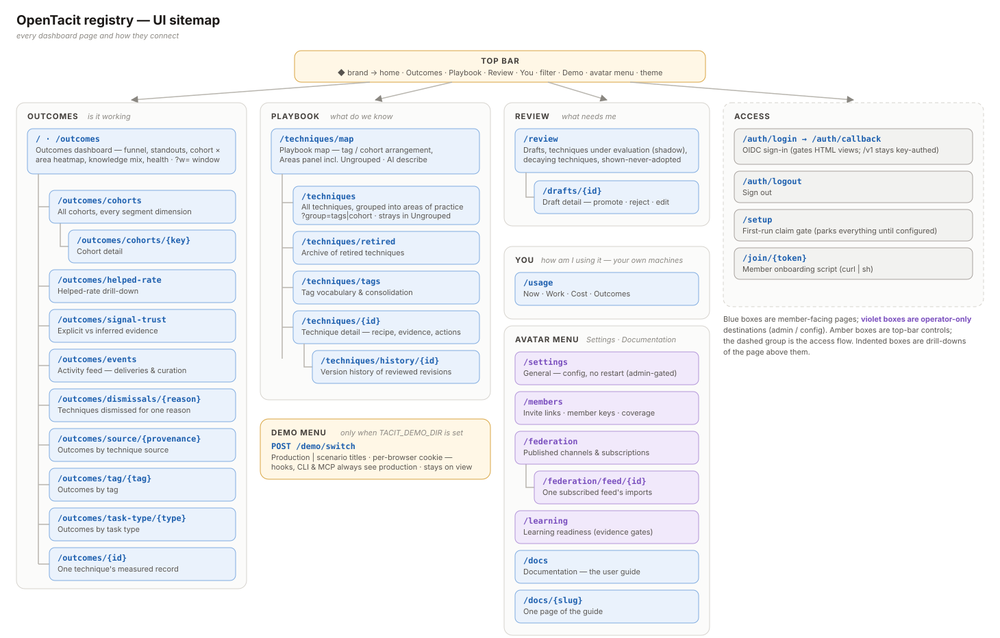

# Sitemap

This page lists every dashboard page and how the pages connect. The four
destinations in the top bar answer these questions:

- **Outcomes** — does it work?
- **Playbook** — what do we know?
- **Review** — what needs me?
- **You** — how am I using it? This is the only personal one, and the only
  view the registry cannot collect: it is read from your own machines. Its own
  Outcomes view asks of you what the first destination asks of the
  organization.

Each destination opens its peer views through the breadcrumb switcher:

- Outcomes opens Overview, Cohorts, Helped rate, Signal trust, and **Events**.
- Playbook opens Map, All, Retired, and Tags.
- You opens Now, Work, Cost, and Outcomes.

The operator's destinations are in Settings, in the avatar menu: General,
Members, Federation and Learning readiness. On a registry that runs
[demonstration mode](../40-administration/14-configure-the-registry.md#demonstration-mode),
a dataset switcher shows beside the menu. Every other registry has none.

## Page inventory

| Route | Page | What it answers |
|---|---|---|
| `/`, `/outcomes` | Outcomes dashboard | The funnel, standout techniques, the cohort × area heatmap (columns are the Playbook map's groups), knowledge mix, registry health. Use `?w=` to set the time window. |
| `/outcomes/cohorts` | All cohorts | Every cohort's adoption across all segment dimensions. |
| `/outcomes/cohorts/{key}` | Cohort detail | One cohort's techniques and funnel. |
| `/outcomes/helped-rate` | Helped rate | How OpenTacit computes the helped rate, and its trend. |
| `/outcomes/signal-trust` | Signal trust | Explicit vs inferred evidence quality. |
| `/outcomes/events` | Events | The activity feed: deliveries and the playbook's own curation. |
| `/outcomes/dismissals/{reason}` | Dismissals | Techniques that members dismissed for one reason. |
| `/outcomes/source/{provenance}` | By source | Outcomes for each technique provenance. |
| `/outcomes/tag/{tag}` · `…/task-type/{type}` | By tag / task type | Outcomes for each area. |
| `/outcomes/{id}` | Technique outcomes | One technique's measured record. |
| `/techniques/map` | Playbook map | The first view of the section: the library as a network. It has tag or cohort arrangement, the Areas overlay, and "Describe with AI". |
| `/techniques` | All techniques | The live library, in groups by area of practice (`?group=tags` or `?group=cohort`). Techniques without a group show in an Ungrouped band. |
| `/techniques/retired` | Archive | Retired techniques, with a restore control on each row. |
| `/techniques/tags` | Tags | The tag vocabulary and the merge tools. |
| `/techniques/{id}` | Technique detail | The technique itself: recipe, evidence, actions. |
| `/techniques/history/{id}` | Technique history | Reviewed revisions over time. |
| `/review` | Review queue | Drafts, decaying techniques, and retrieval misses: the one queue that waits for a person. Techniques under evaluation are listed here too, but they gather evidence on their own. |
| `/drafts/{id}` | Draft detail | One draft, with promote/reject/edit. |
| `/learning` | Learning readiness | Evidence-corpus gates for deeper synthesis (read-only). |
| `/learning/workflows` | Workflow traces | Observed multi-step workflows that feed discovery. |
| `/usage` | You | A member's own activity, through a loopback proxy to this host's hook agent, or a sealed ledger their machines published. The fourth destination in the top bar; the route keeps the name the command line uses. |
| `/federation` | Federation | Published channels and feed subscriptions. |
| `/federation/feed/{id}` | Feed detail | One subscribed feed's imports. |
| `/members` | Members | Invite links, member keys, coverage. |
| `/settings` | Settings › General | Deployment settings that apply without a restart (admin-gated). The same handler serves `/setup` on the first run. |
| `/docs` · `/docs/{slug}` | Documentation | This manual. `/docs` opens the guide; each `/docs/user-guide/...` slug is one page of it. |
| `/auth/login` · `callback` · `logout` | Sign-in | OIDC session flow. It gates HTML views only; `/v1` uses key authentication. |
| `/join/{token}` | Join | The one-line script that connects a new member. |
| `POST /demo/switch` | Demo switch | It sets the dataset cookie for the browser, and returns to the current view. The route exists only where `TACIT_DEMO_DIR` is set; a registry without it answers 404. |
